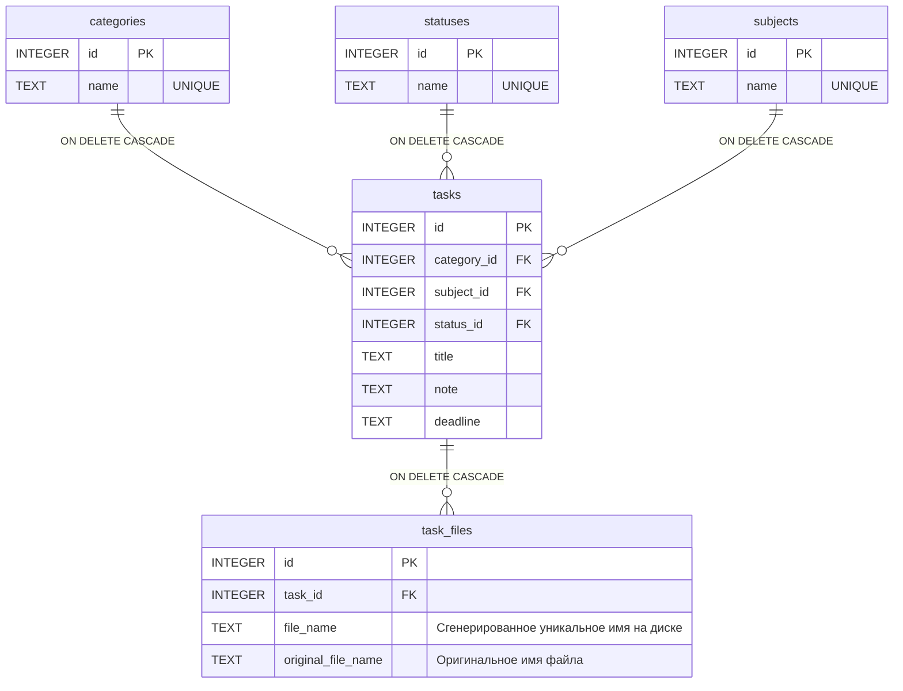

# Учебный Менеджер Студента (Student Manager)

Простое веб-приложение для управления учебными задачами (лабораторными, курсовыми и т.д.) с возможностью прикреплять файлы, фильтровать задачи по дедлайнам и вести собственные справочники предметов и категорий.

Приложение реализует подход **Server-Side Rendering (SSR)**. Весь HTML генерируется на сервере, а обмен данными с сервером происходит посредством классической отправки HTML-форм (без использования клиентского JavaScript для AJAX-запросов).

---

## 🛠 Технологический стек
- **Backend:** Node.js, Express
- **База данных:** SQLite (библиотека `better-sqlite3`)
- **Шаблонизатор:** EJS + `express-ejs-layouts`
- **Загрузка файлов:** Multer
- **Стилизация:** Bootstrap 5 (подключен через CDN)

---

## 🔄 Флоу приложения (User Flow)

1. **Главная страница (Дашборд - `/`)**
   - Пользователь видит список всех своих задач в виде карточек.
   - Слева расположена панель фильтрации, позволяющая отфильтровать задачи по **Статусу**, **Предмету**, а также отсортировать их по **Дедлайну** (сначала срочные / сначала несрочные).
   - На карточке каждой задачи видны прикрепленные файлы, которые можно скачать/посмотреть по клику.
   - С каждой карточки можно перейти к редактированию (`✎`) или удалению (`✕`) задачи.

2. **Создание и редактирование задачи (`/tasks/new` и `/tasks/:id/edit`)**
   - Пользователь заполняет форму: название, категория, предмет, статус, дедлайн, примечание.
   - Пользователь может выбрать **один или несколько файлов** с компьютера для загрузки на сервер.
   - При редактировании задачи пользователь может удалять ранее прикрепленные файлы по отдельности.

3. **Справочники (`/dictionaries`)**
   - Раздел для управления метаданными (Категории, Статусы, Предметы).
   - Пользователь может быстро добавлять новые элементы в справочники с помощью небольших форм сверху списков.
   - В каждой строке списка реализованы инлайн-формы для быстрого **переименования** (кнопка `✎`) и **удаления** (кнопка `✕`) элементов.

---

## 🗄 Модель Базы Данных

База данных SQLite состоит из 5 связанных таблиц. Настроено каскадное удаление (`ON DELETE CASCADE`): при удалении элемента из справочника (например, предмета) или самой задачи, все связанные сущности (задачи этого предмета и прикрепленные файлы) удаляются автоматически.



---

## 🔌 API Маршруты (Routes)

Поскольку это классическое SSR приложение, API возвращает не JSON-данные, а готовые HTML-страницы (через `res.render()`) или выполняет редиректы (`res.redirect()`). 
Для поддержки методов `PUT` и `DELETE` через HTML-формы используется пакет `method-override` (параметр `?_method=...`).

### Задачи (Tasks)
- `GET /` — Главная страница с задачами. Принимает query-параметры `?status=...&subject=...&sort=...` для фильтрации.
- `GET /tasks/new` — Отдает HTML-форму для создания новой задачи.
- `POST /tasks` — Создает новую задачу в БД и сохраняет загруженные файлы на диск (Multer). Редирект на `/`.
- `GET /tasks/:id/edit` — Отдает HTML-форму, заполненную текущими данными задачи.
- `PUT /tasks/:id` — Обновляет данные существующей задачи, сохраняет новые файлы. Редирект на `/`.
- `DELETE /tasks/:id` — Удаляет задачу из БД (каскадно удаляет записи в `task_files`) и физически удаляет файлы с диска.

### Файлы (Files)
- `DELETE /tasks/:taskId/files/:fileId` — Физически удаляет файл с диска и его запись из БД. Редирект обратно на `/tasks/:taskId/edit`.

### Справочники (Dictionaries)
- `GET /dictionaries` — Отдает страницу со списками всех категорий, статусов и предметов.
- **Категории (Categories)**
  - `POST /categories` — Создать новую категорию.
  - `PUT /categories/:id` — Обновить название категории.
  - `DELETE /categories/:id` — Удалить категорию (каскадно удаляет все задачи этой категории).
- **Статусы (Statuses)**
  - `POST /statuses`, `PUT /statuses/:id`, `DELETE /statuses/:id` — Аналогичные операции для статусов.
- **Предметы (Subjects)**
  - `POST /subjects`, `PUT /subjects/:id`, `DELETE /subjects/:id` — Аналогичные операции для учебных предметов.

---

## 🚀 Запуск проекта

1. Установите зависимости (если еще не установлены):
   ```bash
   npm install
   ```
2. Запустите сервер:
   ```bash
   npm start
   ```
3. Откройте браузер и перейдите по адресу: [http://localhost:3000](http://localhost:3000)
